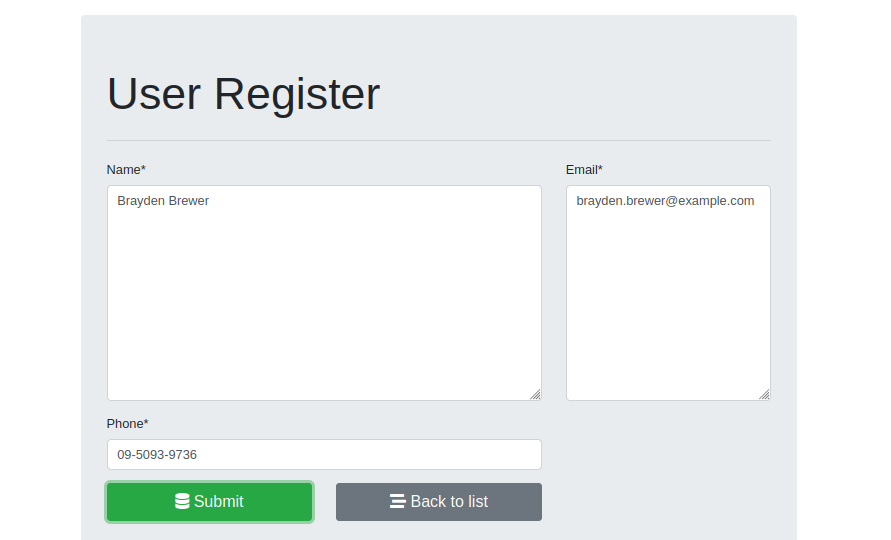

CRUD with Django (Create, Retrieve, Update, Delete)

### Used: Django, Postgresql , Docker ..... 

### Data gathering from https://randomuser.me/

### Check the versions
- django-admin --version
- python3 -m django –version
- docker –version
- psql --version

### Installitions
- pip3 install psycopg2-binary or pip3 install django djangorestframework psycopg2
- pip3 install requests
- pip3 install bootstrap4
- pip3 install django-crispy-forms
- pip3 install Django

### Model-Template-View
- Django follows the MVC pattern, prefers to use its own logic in the implementation, the framework considers handling the Controller part of MVC and letting most of the good stuff happen in the Model-Template-View, that's why Django is mostly called the MTV framework.
- Model: Just like the Model explanation in the MVC pattern , this also takes the same position as the interface or relationship between the data and contains everything related to data access and validation.
- Template: This relates to the View in the MVC pattern as it is the presentation layer that handles the presentation logic in the framework and basically controls what should be displayed and how it should be displayed to the user.
- View: This part relates to the Controller in the MVC pattern and handles all the business logic that throws down back to the respective templates.It serves as the bridge between the model and the template
- https://medium.com/shecodeafrica/understanding-the-mvc-pattern-in-django-edda05b9f43f

 

 

Run: python3 runserver manage.py
